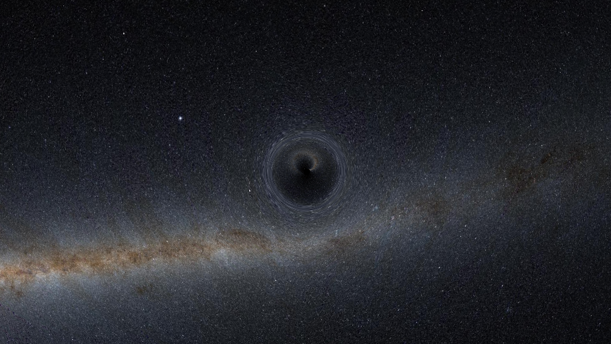
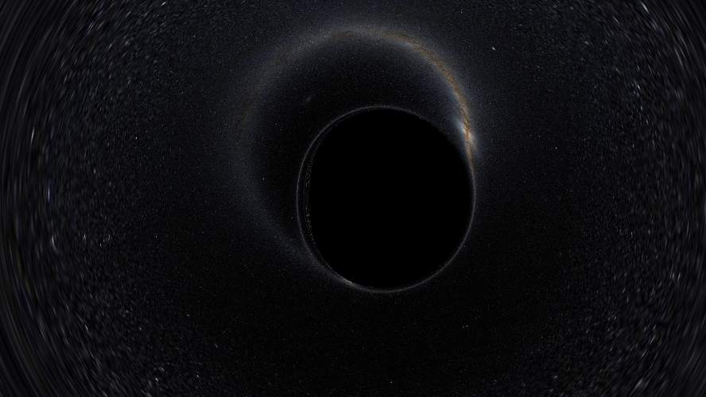

# ✧ Eärendil

**Kerr Black Hole Gravitational Lensing Visualizer**

Real-time visualization of gravitational lensing around a spinning (Kerr) black hole, using real infrared sky data from the 2MASS survey.



## Features

- **Real Sky Data**: 2MASS infrared all-sky survey (J/H/K bands)
- **Kerr Spacetime**: Full rotating black hole solution with spin parameter 0 ≤ a < M
- **Gravitational Lensing**: Accurate null geodesic ray tracing
- **Relativistic Effects**: Gravitational redshift and lensing magnification
- **GPU Accelerated**: JAX with CUDA support for fast rendering

## Quick Start (Docker)
```bash
git clone https://github.com/KstrsKostas/earendil.git
cd earendil

xhost +local:docker
docker compose build
docker compose up
```

## Quick Start (Python)
```bash
git clone https://github.com/KstrsKostas/earendil.git
cd earendil

pip install -r requirements.txt

python main.py
```

## Requirements

### Docker (Recommended)
- Docker with Compose
- NVIDIA GPU + Container Toolkit

### Python
- Python 3.10+
- NVIDIA GPU with CUDA 12+
- ~500MB disk space for sky cache

## Controls

| Parameter | Description |
|-----------|-------------|
| Distance | Observer distance from black hole (M) |
| Inclination | Viewing angle from spin axis (degrees) |
| Spin (a/M) | Black hole angular momentum (0 = Schwarzschild, 0.998 = near-extremal) |
| FOV | Field of view (degrees) |
| Quality | Render resolution |

## Physics

The ray tracer solves null geodesics in Kerr spacetime using Boyer-Lindquist coordinates. Key effects visualized:

- **Frame Dragging**: Spacetime rotation near the black hole
- **Photon Sphere**: Unstable circular photon orbits
- **Event Horizon**: Boundary of no return
- **Einstein Ring**: Light bent from behind the black hole

## Sky Data

Sky texture from [2MASS](https://www.ipac.caltech.edu/2mass/) via [CDS HiPS2FITS](https://alasky.cds.unistra.fr/hips-image-services/hips2fits).

## Credits

Created by **K. Kostaros**

## License

```
MIT License

Copyright (c) 2024 K. Kostaros

Permission is hereby granted, free of charge, to any person obtaining a copy
of this software and associated documentation files (the "Software"), to deal
in the Software without restriction, including without limitation the rights
to use, copy, modify, merge, publish, distribute, sublicense, and/or sell
copies of the Software, and to permit persons to whom the Software is
furnished to do so, subject to the following conditions:

The above copyright notice and this permission notice shall be included in all
copies or substantial portions of the Software.

THE SOFTWARE IS PROVIDED "AS IS", WITHOUT WARRANTY OF ANY KIND, EXPRESS OR
IMPLIED, INCLUDING BUT NOT LIMITED TO THE WARRANTIES OF MERCHANTABILITY,
FITNESS FOR A PARTICULAR PURPOSE AND NONINFRINGEMENT. IN NO EVENT SHALL THE
AUTHORS OR COPYRIGHT HOLDERS BE LIABLE FOR ANY CLAIM, DAMAGES OR OTHER
LIABILITY, WHETHER IN AN ACTION OF CONTRACT, TORT OR OTHERWISE, ARISING FROM,
OUT OF OR IN CONNECTION WITH THE SOFTWARE OR THE USE OR OTHER DEALINGS IN THE
SOFTWARE.
```

---

